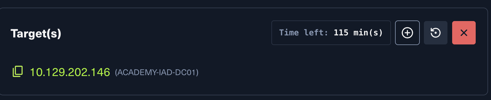

## AD Administration: Guided Lab Part I

---

## Lab Setup



To connect to the lab environment, I spawned the target machine and used the following RDP command from the Pwnbox terminal:

```bash
xfreerdp /v:10.129.202.146 /u:htb-student_adm /p:Academy_student_DA!
```

Once connected, I had access to a domain-joined Windows Server with AD tools available.

---

## Task 1: Managing Users

### Adding New Users

I was asked to add three new-hire users into the domain under:
`inlanefreight.local > Corp > Employees > HQ-NYC > IT`

The users to add were:
- Andromeda Cepheus
- Orion Starchaser
- Artemis Callisto

Each user needed the following attributes:
- Full name
- Email address (format: `first-initial.lastname@inlanefreight.local`)
- Display name
- User must change password at next logon

#### Steps I Followed (PowerShell)

First, I loaded the Active Directory module:

```powershell
Import-Module -Name ActiveDirectory
```

Then I added each user using the `New-ADUser` cmdlet. For example, to add Orion Starchaser:

```powershell
New-ADUser -Name "Orion Starchaser" -Accountpassword (ConvertTo-SecureString -AsPlainText (Read-Host "Enter a secure password") -Force) -Enabled $true -OtherAttributes @{'title'="Analyst";'mail'="o.starchaser@inlanefreight.local"}
```

#### Steps I Followed (GUI via ADUC)

For Andromeda Cepheus, I used the Active Directory Users and Computers (ADUC) snap-in:

1. Opened **Server Manager > Tools > Active Directory Users and Computers**
2. Expanded `inlanefreight.local > Corp > Employees > HQ-NYC > IT`
3. Right-clicked on the **IT** OU and selected **New > User**
4. Entered the first name, last name, and set the logon name as `acepheus`
5. Set a temporary password `NewP@ssw0rd123!` and checked **"User must change password at next logon"**
6. Clicked **Finish** to complete the creation

---

### Removing Old User Accounts

An audit identified two accounts that were no longer needed:
- Mike O'Hare
- Paul Valencia

#### Steps I Followed (PowerShell)

```powershell
Remove-ADUser -Identity pvalencia
```

#### Steps I Followed (GUI)

1. Right-clicked on the **Employees** OU and selected **Find**
2. Searched for `Paul Valencia` and clicked **Find Now**
3. Right-clicked the user in the results and selected **Delete**
4. Confirmed the deletion in the popup window
5. Repeated the same process for Mike O'Hare

---

### Unlocking Adam Masters' Account

A helpdesk ticket came in — Adam Masters locked himself out after entering his password incorrectly too many times. After verifying his identity, I needed to:
- Unlock his account
- Reset his password
- Force a password change at next login

#### Steps I Followed (PowerShell)

```powershell
# Unlock the account
Unlock-ADAccount -Identity amasters

# Reset the password
Set-ADAccountPassword -Identity 'amasters' -Reset -NewPassword (ConvertTo-SecureString -AsPlainText "NewP@ssw0rdReset!" -Force)

# Force password change at next logon
Set-ADUser -Identity amasters -ChangePasswordAtLogon $true
```

#### Steps I Followed (GUI)

1. Located Adam Masters' account in ADUC
2. Right-clicked the account and selected **Reset Password**
3. Entered a temporary password and confirmed it
4. Checked both **"User must change password at next logon"** and **"Unlock the user's account"**
5. Clicked **OK** to apply the changes

---

## Task 2: Managing Groups and Organizational Units

I was asked to create a new Security Group called **Security Analysts** and add the new-hire users into it. This group also needed its own OU nested inside the IT hive.

#### Steps I Followed (PowerShell)

```powershell
# Create the new OU
New-ADOrganizationalUnit -Name "Security Analysts" -Path "OU=IT,OU=HQ-NYC,OU=Employees,OU=Corp,DC=inlanefreight,DC=local"

# Create the Security Group
New-ADGroup -Name "Security Analysts" -GroupScope Global -GroupCategory Security -Path "OU=Security Analysts,OU=IT,OU=HQ-NYC,OU=Employees,OU=Corp,DC=inlanefreight,DC=local"

# Add new users to the group
Add-ADGroupMember -Identity "Security Analysts" -Members acepheus, ostarchaser, acallisto
```

#### Steps I Followed (GUI)

1. Right-clicked on the **IT** OU in ADUC and selected **New > Organizational Unit**
2. Named it `Security Analysts` and clicked OK
3. Right-clicked on the new OU and selected **New > Group**
4. Named the group `Security Analysts`, set the scope to **Global** and type to **Security**
5. Added the three new users as members of the group

---

## Task 3: Managing Group Policy Objects

I was asked to duplicate an existing GPO called **Logon Banner**, rename it to **Security Analysts Control**, and modify it for the Security Analysts OU with the following settings:

**User Settings:**
- Updated password policy
- Explicitly allowed access to PowerShell and CMD

**Computer Settings:**
- Logon Banner applied
- Removable media access blocked

Finally, I linked the GPO to the **Security Analysts** OU.

#### Steps I Followed (PowerShell)

```powershell
# Copy the existing GPO
Copy-GPO -SourceName "Logon Banner" -TargetName "Security Analysts Control"
```

#### Steps I Followed (GUI via Group Policy Management)

1. Opened **Server Manager > Tools > Group Policy Management**
2. Located the **Logon Banner** GPO, right-clicked and selected **Copy**
3. Pasted it and renamed it to `Security Analysts Control`
4. Right-clicked the new GPO and selected **Edit** to open the Group Policy Management Editor
5. Under **Computer Configuration > Policies > Windows Settings > Security Settings**, configured the Logon Banner message
6. Under **Computer Configuration**, navigated to removable media settings and set them to **Disabled**
7. Under **User Configuration**, modified the password policy settings for the group
8. Explicitly allowed CMD and PowerShell access under application control settings
9. Closed the editor, then right-clicked the **Security Analysts** OU in Group Policy Management and selected **Link an Existing GPO**
10. Selected **Security Analysts Control** and confirmed the link

---

## Summary

In this lab, I practiced core Active Directory administration tasks that sysadmins perform daily:

- Created new user accounts with required attributes using both PowerShell and the ADUC GUI
- Removed stale user accounts identified in an audit
- Unlocked a locked-out user account and forced a password reset
- Created a new Organizational Unit and Security Group and added users to it
- Copied and modified a Group Policy Object and linked it to the appropriate OU

These tasks gave me hands-on experience with AD user lifecycle management, group administration, and Group Policy configuration — all of which are critical skills for both system administrators and penetration testers.