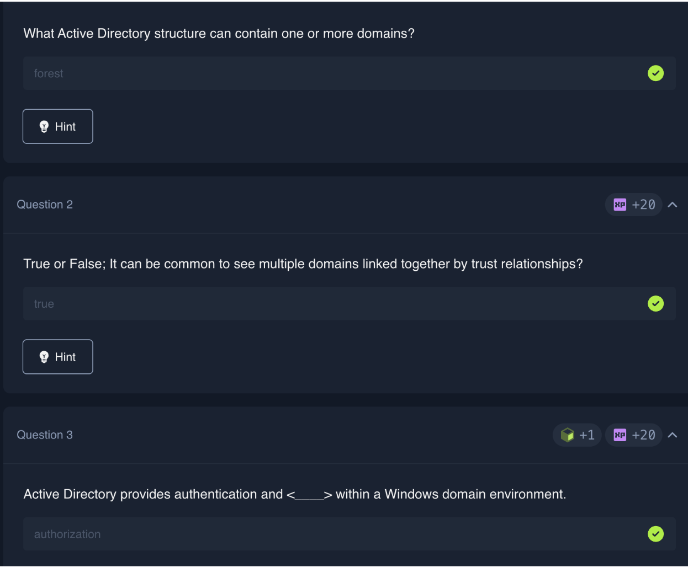
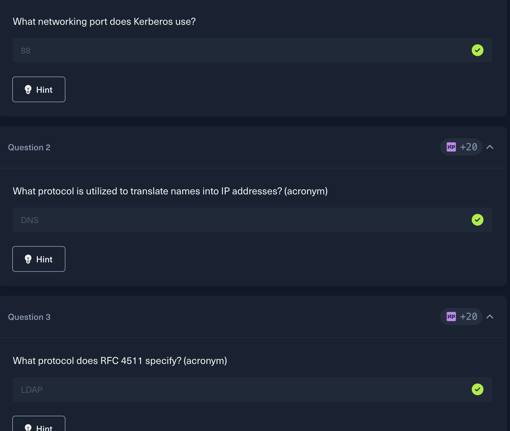
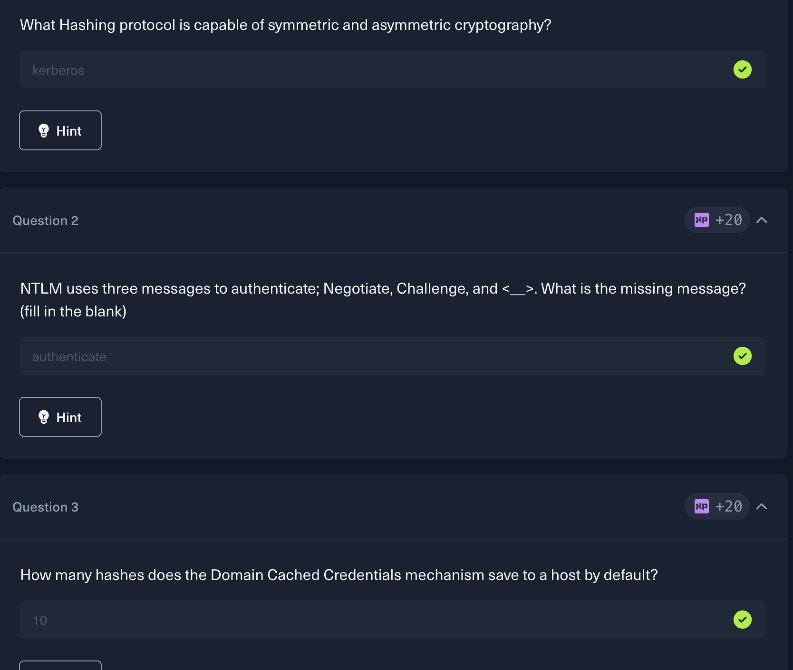
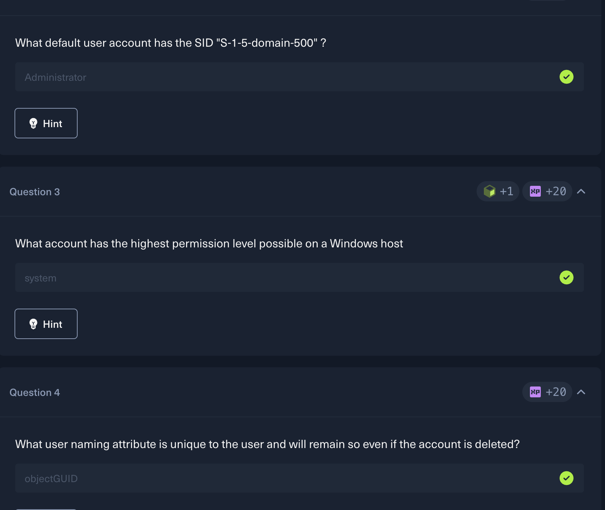
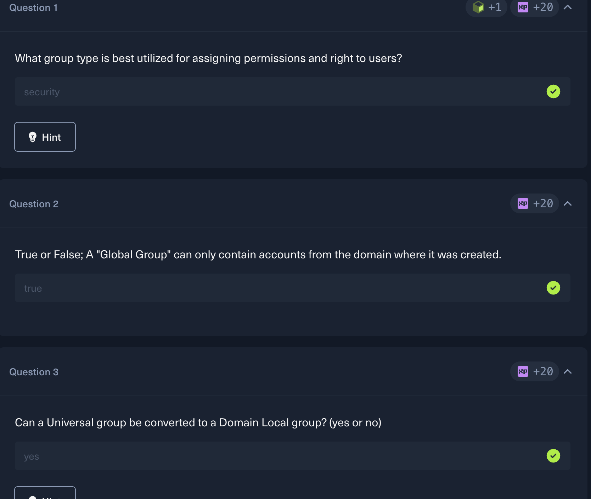
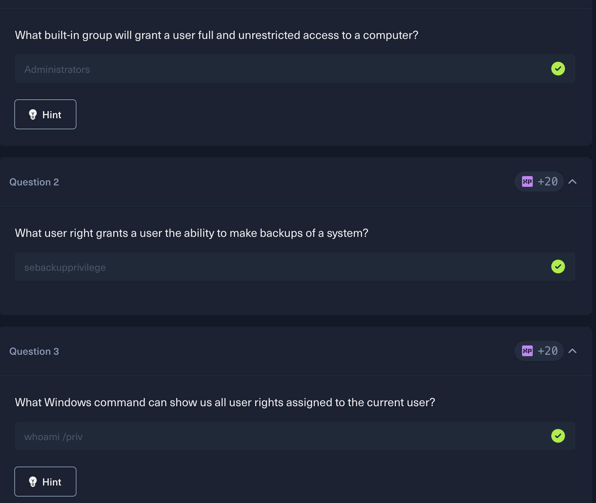
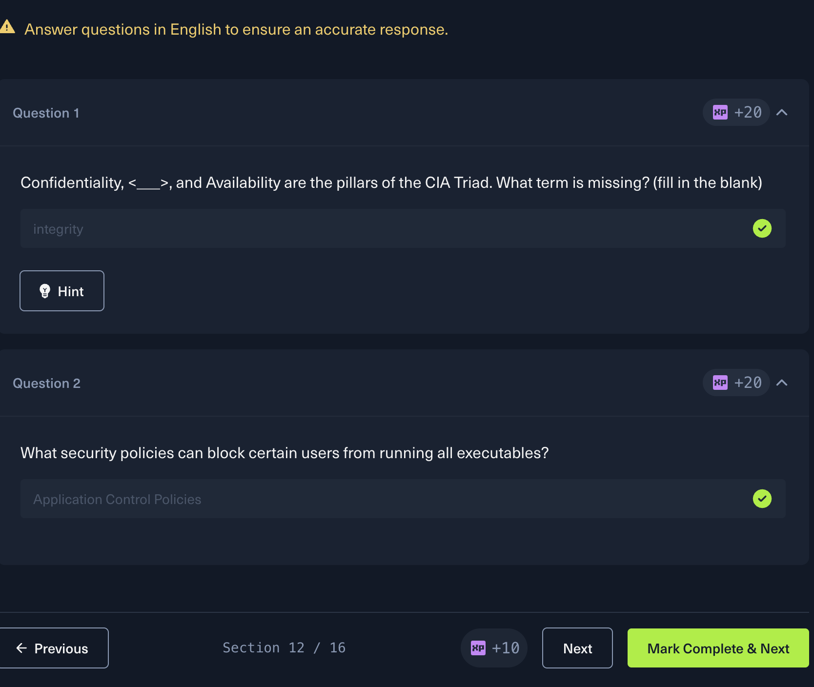
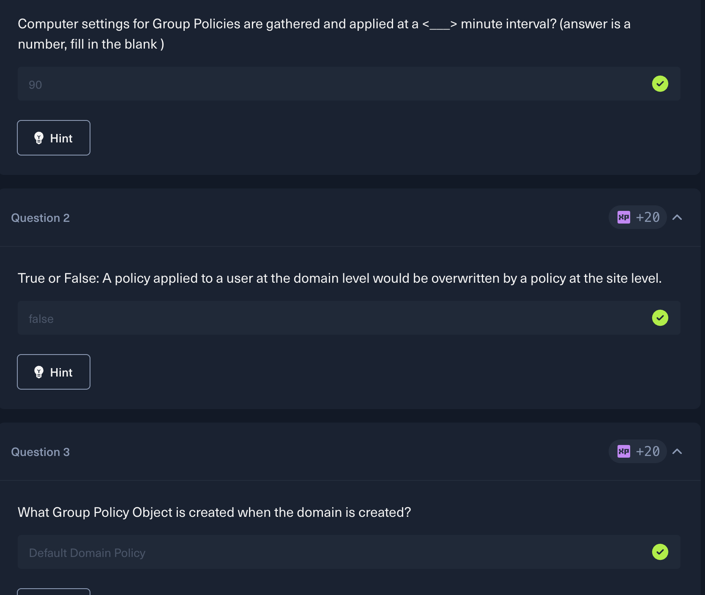

# lab8_sws202

# Introduction to Active Directory

!! LABS ARE IN ASSIGNMENT4 !!

## Why Active Directory?
Microsoft’s Active Directory (AD) provides an organization with central administration of information about users, computers, printers, file shares and other objects in a network. It can be thought of as the combination of a company telephone directory and a security guard - it lets you know who you are, what you can access, and allows you to log in once to use all resources.

### Things to remember:

AD is used by 95% of the companies included in the Fortune 500 list; so it is widely used.

Almost anyone using AD can read from most of the AD database, even if the user has no rights above those granted to a normal employee. This is by design; however, this inability to restrict access to regular users is a significant security risk.

AD has been created to maintain compatibility with previous versions of AD, meaning that if you have previously configured an object or settings in AD that are considered insecure, they remain in place and will continue to function. These are the types of settings used by an attacker to create a backdoor entry into an organization’s network.

An attacker can frequently obtain enough network information about an entire organization if just one employee account can be phished away.

Large ransomware gangs such as Conti specifically target AD by exploiting vulnerabilities such as PrintNightmare and Zerologon.

Why it matters for us (pentesters):

Even a basic domain user account can be used to find misconfigurations and launch attacks. That's why securing AD properly is critical.

## History of Active Directory
Year				What Happened

1971				LDAP (the foundation of AD) first introduced
1990				Microsoft's first attempt at directory services with Windows NT 3.0
1993				Novell released the earliest directory system (X.500)
1997				First beta of Active Directory released
2000				AD officially shipped with Windows Server 2000
2003				Added Forests — separate containers for domains under one roof
2008				ADFS introduced — Single Sign-On across organizations
2016				gMSA added (helps defend against Kerberoasting); Azure AD Connect launched for cloud migration

Simple way to remember it:

AD started as an idea in the 70s (LDAP)

Became real with Windows 2000

Kept growing — forests, SSO, cloud support

Has been getting attacked and patched ever since

ADFS in plain English:

Imagine logging into your work account once and it automatically logs you into Gmail, Slack, and your HR portal. That's what ADFS does - one login, many apps.

## What is AD Structure?
Active Directory is organized like a family tree - everything is nested inside each other in a hierarchy. At the very top is the Forest, then Domains, then Organizational Units (OUs), and finally the actual objects like users and computers.

### The Building Blocks
#### Forest
The outermost container - think of it as the whole company

It's the security boundary - everything inside is under one administration

A forest can hold multiple domains

#### Domain
A domain is like a department or branch inside the company

Contains users, computers, and groups

Can have child domains (sub-domains) nested inside it

Example: INLANEFREIGHT.LOCAL is the root, with ADMIN.INLANEFREIGHT.LOCAL and DEV.INLANEFREIGHT.LOCAL as children

#### Organizational Units (OUs)

Folders inside a domain used to organize objects

Example: an OU called EMPLOYEES can contain sub-OUs for USERS, COMPUTERS, and GROUPS

You can apply Group Policies (GPOs) to OUs to control settings for everyone inside

### What Can a Regular User See?
This is the scary part - even a basic user with no special rights can read:

- List of all domain computers and users
- Group information and OUs
- Password policies and GPOs
- Domain trusts and Access Control Lists (ACLs)

AD is essentially an open database for anyone inside the domain. That's why misconfigurations are so dangerous.

## Domain Trusts - The Risky Bridges

When companies merge or get acquired, instead of recreating all users, they set up a trust between domains/forests

A bidirectional trust means both sides can access each other's resources But trusts don't automatically flow down - a trust between two root domains doesn't mean child domains automatically trust each other

Example: even if inlanefreight.local and freightlogistics.local trust each other, a user in admin.dev.freightlogistics.local cannot access wh.corp.inlanefreight.local without a separate trust being set up

Poorly managed trusts are a goldmine for attackers to move between domains

#### Why This Matters for Pentesting

Understanding the structure tells you where to look for misconfigurations

Knowing how trusts work helps you find paths to escalate from a low-privilege domain to a high-value one

As the module says: "It's always easier to break things if you already know how to build them."

## AD Objects

Active Directory is made up of objects - basically anything that exists inside AD is an object. 

### Users

Represent people in the organization

Are security principals - they have a SID and GUID

Can have 800+ attributes (name, email, last login, etc.)

Prime target for attackers - even a low-privilege user can enumerate the whole domain

### Contacts

Represent external people (vendors, customers)

NOT security principals - only have a GUID, no SID

Purely informational, can't be used to log in or access resources

### Computers

Any machine joined to the AD network

ARE security principals (SID + GUID)

Compromising a computer gives attacker NT AUTHORITY\SYSTEM rights - nearly as 
powerful as a domain user for enumeration

### Printers & Shared Folders

Point to network printers and shared folders

NOT security principals - GUID only

Shared folders can be open to everyone or locked down - misconfigured shares are a common attack target

### Groups

Container objects - can hold users, computers, even other groups

ARE security principals (SID + GUID)

Used to manage permissions in bulk

Nested groups (groups inside groups) can accidentally give users more rights than intended - BloodHound is the go-to tool to map this out

### Organizational Units (OUs)

Folders used by admins to organize objects

Used for delegating admin tasks without giving full domain admin rights

GPOs can be applied to OUs to enforce policies on everyone inside

Example: Help Desk OU members can be given password reset rights only

### Domain

The overall structure/container of the AD network

Has its own database and policies

Everything lives inside a domain

### Domain Controllers (DCs)

The brain of AD - handles all authentication and authorization

Validates every access request

Enforces security policies and stores info on all objects

Most critical asset in any AD environment - if an attacker owns the DC, they own everything

### Sites

Groups of computers connected via high-speed links

### Built-in Container

Holds default groups that come pre-created when a domain is set up

Examples: Administrators, Users, Guests

### Foreign Security Principals (FSPs)

Placeholder objects created when a user/group from another forest is added to a group in the current domain

Stores the SID of the external object so Windows can resolve it via trust relationships

## AD Protocols

Active Directory relies on four core protocols to function: Kerberos, DNS, LDAP, and MSRPC. Each plays a specific role in how users authenticate, communicate, and access resources across the network.

Kerberos is the main authentication protocol in AD since Windows 2000. Instead of sending your password over the network, it uses tickets. When you log in, the Key Distribution Center (KDC) on the Domain Controller gives you a Ticket Granting Ticket (TGT). You then use that TGT to request access to specific services, getting a TGS ticket in return. The service checks that ticket and lets you in — your password never travels the wire. It runs on port 88. For attackers, this ticket system is the basis of attacks like Kerberoasting and Pass-the-Ticket.

DNS is how everything finds each other in AD. Clients use DNS to locate Domain Controllers, and DCs use it to talk among themselves. AD stores service locations as SRV records and uses Dynamic DNS to auto-update when IPs change. Runs on port 53. A simple nslookup can reveal DC hostnames and IPs — useful during recon. LDAP is the protocol applications use to actually query and talk to AD — think of it as the language AD speaks. It runs on port 389 (or 636 for encrypted LDAPS). Authentication happens via a BIND operation — either simple (username/password) or SASL (using Kerberos). Critical warning: LDAP sends data in cleartext by default, making it sniffable on the internal network.

MSRPC is Microsoft's implementation of Remote Procedure Call — essentially how Windows programs talk to each other across a network. Four key interfaces matter for security: lsarpc (manages security policies), netlogon (authenticates users in the background), samr (manages users/groups — attackers abuse this with BloodHound to map out AD), and drsuapi (handles DC replication — attackers abuse this to dump the entire NTDS.dit file containing all password hashes in a DCSync attack).

## NTLM Authentication

## User and Machine Accounts

## Active Directory Groups

## Active Directory Rights and Privileges

## Security in Active Directory

Active Directory is insecure by design — it was built to share information quickly and easily, which means security often takes a back seat. Out of the box, a fresh AD installation is missing most hardening measures. Think of it like a new house with no locks installed — you have to add them yourself.

**Key Hardening Measures**

### LAPS (Local Administrator Password Solution)
Microsoft's free tool that automatically rotates local admin passwords on every machine (every 12-24 hours). This way, if one computer gets hacked, the attacker can't use the same password to hop to other machines.

### Logging and Monitoring
You can't defend what you can't see. Organizations need proper logging to catch suspicious activity — like someone trying thousands of passwords (password spraying), or a random user suddenly getting added to a privileged group at 2am.

### Group Policy (GPOs)
GPOs let admins enforce security rules across the whole domain at once — things like password complexity requirements, locking accounts after failed logins, restricting which software can run, and blocking access to PowerShell or CMD for regular users.

### Patch Management (WSUS/SCCM)

Keeping Windows systems updated is critical. Unpatched systems are low-hanging fruit for attackers. WSUS is Microsoft's free update tool; SCCM is a paid, more powerful version.

### Group Managed Service Accounts (gMSA)
Service accounts with auto-rotating 120-character passwords managed by the DC. Nobody knows the password — it just works. Helps defend against Kerberoasting attacks.

### Account Separation
Admins should have two accounts — one for daily tasks (email, browsing) and a separate admin account for privileged work. If the daily account gets phished, the attacker doesn't automatically get domain admin access.

### Strong Passwords + MFA
Passwords shorter than 12 characters can be cracked quickly offline. Common passwords like Welcome1 technically pass complexity rules but are the first ones attackers try. Use passphrases, a password manager, and always enable MFA for remote access.

### Limit Domain Admin Usage
Domain Admin accounts should only ever log into Domain Controllers — never regular workstations. Otherwise, credentials get cached in memory on machines all over the network, making them easy to steal.

### Clean Up Stale Accounts
Old unused accounts (especially service accounts with weak old passwords) are a goldmine for attackers. Regularly audit and disable or delete anything no longer in use.

### Limit Local Admin and RDP Rights
Not every user needs local admin on their machine. Tightly control who can administer what, and who can remotely connect via RDP. The fewer people with elevated access, the smaller the attack surface.

## Examining Group Policy

